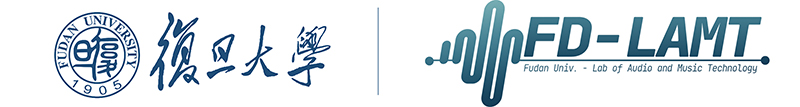
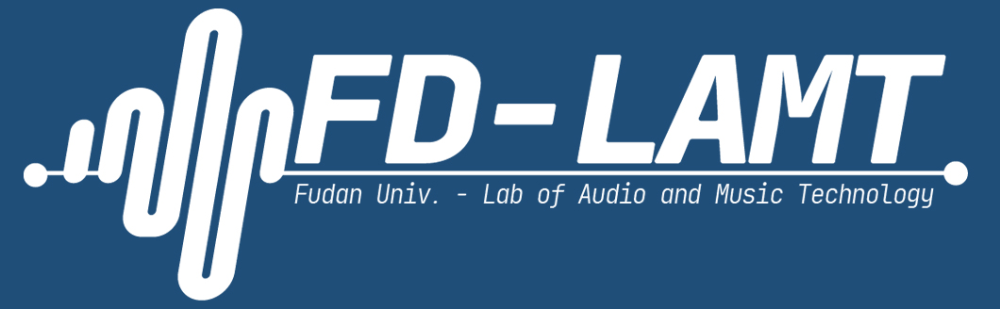

FD LAMT LOGO 使用说明
===========================


本 LOGO 为复旦大学音频音乐技术实验室 Fudan University Laboratory of Audio and Music Technology, FD LAMT 设计 希望能运用于平时与实验室有关的活动、汇报或总结中 。 关于LOGO的若干版式设计如下：


## 版式预览
	
|作者|果冻虾仁|
|---|---|
||__彩色版本:__ 用于浅色底色。左边是wavefom（音频）结合电子管（计算机）元素的设计。右边横线上方为实验室简称，横线下方为实验室全称。考虑到美观和字体，University用简写 Univ. 表述；“实验室”一词用 Lab 表述。字体为标准化过后的编程用字体 JetBrains Mono.|
||__反色版本:__ 白色LOGO. 用于深色底色（如嵌入复旦大学的 PPT 模板中）。|
||__ICON版本:__ 正方形版本。可以用于头像、图标等情况。|
||__版头 / 页脚:__ 长条版本.可用作对外文书或PPT的头部或页脚上（如本页最上方）。|

****


本LOGO全部以.png图片的形式开放给FD-LAMT实验室的全部老师同学们使用.
希望老师同学们一切顺顺利利，实验室越来越好！੭ ᐕ ੭

```diff
# 何其锜
# 2021 年 12 月 10 日

```
