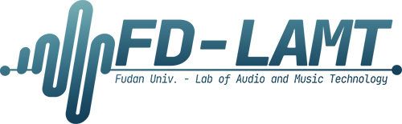

FD-LAMT LOGO 使用说明
===========================


本 LOGO 为复旦大学音频音乐技术实验室(Fudan University Laboratory of Audio and Music Technology, FD-LAMT)设计,希望能运用于平时与实验室有关的活动、汇报或总结中.</br>
</br>
关于LOGO的若干版式设计如下：


## 版式预览
	
|版式|说明（获取请直接点击版本标题）|
|:---:|---|
||__[彩色版本:](./LOGOs/lamtogo_color.png)__ 用于浅色底色。左边是wavefom（音频）结合电子管（计算机）元素的设计。右边横线上方为实验室简称，横线下方为实验室全称。考虑到美观和字体，University用简写 Univ. 表述；“实验室”一词用 Lab 表述。字体为标准化过后的编程用字体 JetBrains Mono.|
||__[版头 / 页脚:](./LOGOs/lamtogo_long.png)__ 长条版本.可用作对外文书或PPT的头部或页脚上（如本页最上方）。|
||__[ICON版本:](./LOGOs/lamtogo_icon.png)__ 正方形版本。可以用于头像、图标等情况。|
||__[反色版本（获取请点此处）:](./LOGOs/lamtogo_white.png)__ 白色LOGO.</br>使用方法：点击上方跳转后，直接复制或下载空白内容（因为底色和图标都是白色，所以看起来是空白的，直接复制即可）</br></br>用于深色底色（如嵌入复旦大学的 PPT 模板中）。|
||__[版头 / 页脚（单色，获取请点此处）:](./LOGOs/lamtogo_line_white.png)__ 长条单色.</br>使用方法：点击上方跳转后，直接复制或下载空白内容（因为底色和图标都是白色，所以看起来是空白的，直接复制即可）</br></br>可用作深色对外文书或PPT的头部或页脚上（如PPT模板页脚）。|

****


本LOGO全部以.png图片的形式开放给FD-LAMT实验室的全部老师同学们使用.</br>
希望老师同学们一切顺顺利利，实验室越来越好！੭ ᐕ ੭

```diff
# 何其锜
# 2021 年 12 月 10 日

```
